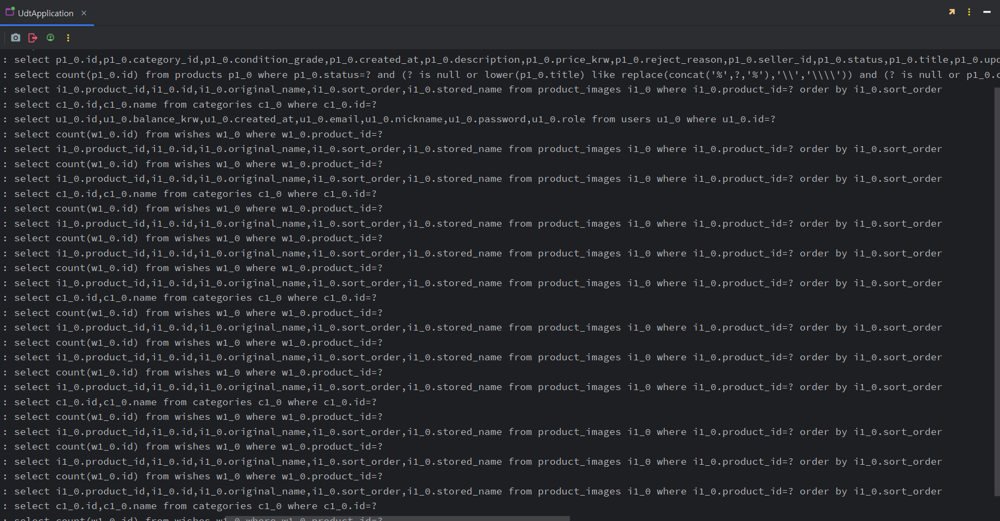
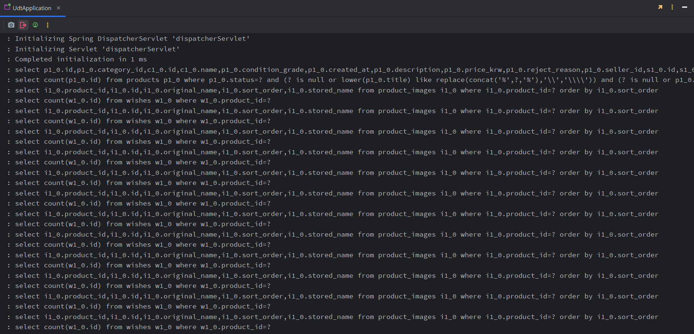
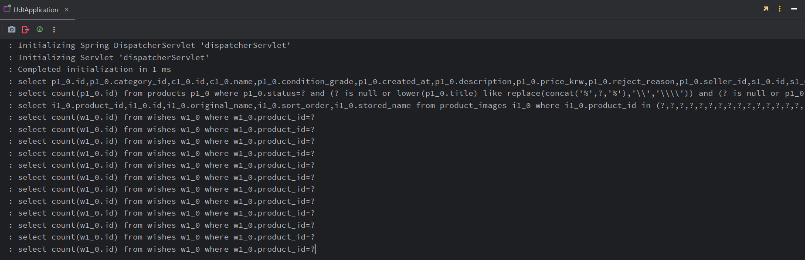
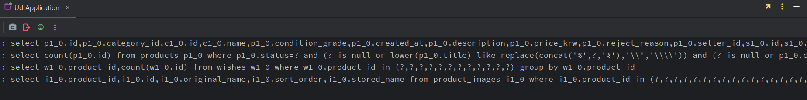

## 1. 문제 상황 — 상품 목록 API 1번에 쿼리 32개  

- 대상: `GET /api/products?page=0&size=12` (판매중 상품 목록, 한 페이지 12건)  

- 화면에 상품 12개를 띄우는데 SQL이 **32번** 실행됨 → 상품 수가 늘어날수록 쿼리도 비례해서 늘어나는 전형적인 **N+1 문제**  

    

- 측정 방법: `org.hibernate.SQL` 로그를 DEBUG로 켜고 요청 1번에 찍힌 `select` 줄 수를 셈  

---

## 2. 원인 분석 — 32개는 어디서 나왔나  

- `findProductsWithOptions`는 상품 목록 1줄 + 페이징 count 1줄만 실행하고 상품 12개를 서비스에 넘김  

- 이후 `ProductService.getProducts()` → `toSummaryResponse()`에서 DTO를 만들면서 **지연 로딩(LAZY)** 된 연관 엔티티에 접근할 때마다 추가 쿼리가 발생  

    | 쿼리 | 발생 위치 | 횟수 |
    | :--- | :--- | :--- |
    | 상품 목록 | `findProductsWithOptions` | 1 |
    | 페이징 count | `countQuery` | 1 |
    | 이미지 | `product.getImages()` — 상품마다 | 12 |
    | 찜 수 | `wishRepository.countByProductId()` — 상품마다 | 12 |
    | 카테고리 | `product.getCategory()` — 처음 보는 카테고리마다 | 5 |
    | 판매자 | `product.getSeller()` — 처음 보는 판매자마다 | 1 |
    | **합계** | | **32** |

- 카테고리·판매자가 12번이 아니라 5번·1번인 이유: 같은 id는 **영속성 컨텍스트(1차 캐시)** 에 이미 있으므로 다시 조회하지 않음  

- 연관관계 종류에 따라 해결 방법을 다르게 선택  

    | 연관 | 관계 | 해결 방법 |
    | :--- | :--- | :--- |
    | 상품 - 판매자 | N:1 (`@ManyToOne`) | Fetch Join |
    | 상품 - 카테고리 | N:1 (`@ManyToOne`) | Fetch Join |
    | 상품 - 이미지 | 1:N (`@OneToMany`) | Batch Size |
    | 상품 - 찜 수 | 집계 값 (엔티티 아님) | `GROUP BY` 집계 쿼리 |

---

## 3. 해결 ① Fetch Join — 32 → 26  

- N:1 관계인 `seller`, `category`를 목록 쿼리에서 `JOIN FETCH`로 함께 로딩  

    ```java
    @Query(
        value = "SELECT p FROM Product p " +
                "JOIN FETCH p.seller " +
                "JOIN FETCH p.category " +
                "WHERE p.status = :status ...",
        countQuery = "SELECT COUNT(p) FROM Product p WHERE p.status = :status ..."
    )
    Page<Product> findProductsWithOptions(...);
    ```

- N:1은 조인해도 상품 1건당 행이 1개로 유지되므로 **페이징(`limit`)과 함께 써도 안전**  

- 목록 쿼리에 `FETCH`가 들어가므로 `countQuery`를 따로 작성해 count 쿼리에는 불필요한 조인이 붙지 않게 함 (`WHERE` 조건은 목록 쿼리와 동일하게 유지)  

- 결과: 카테고리 5줄, 판매자 1줄이 사라져 **26개**  

    

---

## 4. 해결 ② Batch Size — 26 → 15  

- 이미지는 1:N 컬렉션이므로 Fetch Join을 쓰지 않음  

    - 컬렉션을 Fetch Join하면 상품 1건이 이미지 수만큼 행으로 늘어나 DB `limit`으로 정확히 자를 수 없음  

    - Hibernate가 `limit` 없이 전체를 읽은 뒤 **메모리에서 페이징**(`HHH90003004` 경고)하게 되어 데이터가 많아지면 위험  

- 대신 `default_batch_fetch_size`로 지연 로딩 시점에 여러 상품의 이미지를 `IN` 절 한 번으로 묶어서 조회  

    ```yaml
    spring:
      jpa:
        properties:
          hibernate:
            default_batch_fetch_size: 100
    ```

    ```sql
    -- 전: 상품마다 1번씩, 12번
    select ... from product_images where product_id = ?
    -- 후: 1번
    select ... from product_images where product_id in (?, ?, ..., ?)
    ```

- **100으로 정한 이유**: 목록 API의 `size` 최대 상한이 100이므로 어떤 페이지 크기든 batch 쿼리 1번 안에 끝남  

- 결과: 이미지 12줄 → 1줄, **15개**  

    

---

## 5. 해결 ③ 찜 수 집계 쿼리 — 15 → 4  

- 찜 수는 엔티티가 아니라 `COUNT` 결과이므로 Fetch Join·Batch Size로는 줄일 수 없음 → JPQL로 **직접 한 번에 집계**  

    ```java
    @Query("select w.product.id, count(w) from Wish w " +
           "where w.product.id in :productIds " +
           "group by w.product.id")
    List<Object[]> findWishCountsByProductIds(@Param("productIds") List<Long> productIds);
    ```

- 서비스에서 결과를 `Map<상품 id, 찜 수>`로 바꾼 뒤 DTO 변환 시 꺼내 씀  

    ```java
    Map<Long, Integer> wishCounts = getWishCounts(pages.getContent());

    pages.map(product ->
            toSummaryResponse(product, wishCounts.getOrDefault(product.getId(), 0)));
    ```

- 찜이 0개인 상품은 `GROUP BY` 결과에 행 자체가 없으므로 `getOrDefault(..., 0)`로 처리  

- 결과: 찜 수 12줄 → 1줄, **최종 4개**  

    

---

## 6. 결과  

| 단계 | 적용 | 쿼리 수 |
| :--- | :--- | :---: |
| Before | — | 32 |
| ① | Fetch Join (`seller`, `category`) | 26 |
| ② | `default_batch_fetch_size: 100` (`images`) | 15 |
| ③ | 찜 수 `GROUP BY` 집계 쿼리 | **4** |

- 최종 4개: 상품+판매자+카테고리 1 / 페이징 count 1 / 찜 수 1 / 이미지 1  

- 가장 중요한 변화는 숫자 자체보다 **상품 수와 무관하게 쿼리 수가 고정**된다는 점 → `size=12`든 `size=100`이든 4개  

- 부가 수정: 시드 데이터의 `createdAt`이 모두 같아 페이지마다 순서가 흔들리므로 `ORDER BY p.createdAt DESC, p.id DESC`로 **동률 정렬 기준** 추가  

---

## 7. 결론   

- N+1은 쿼리를 짤 때가 아니라 **DTO로 변환하면서 연관 엔티티에 접근하는 순간** 생김 → 로그로 실제 쿼리를 확인하기 전에는 보이지 않음  

- 연관관계 종류에 따라 도구가 다름  

    - N:1 → Fetch Join  
    - 1:N 컬렉션 + 페이징 → Batch Size  
    - 개수·합계 같은 집계 → `GROUP BY` 쿼리로 직접  

- 한 번에 다 고치지 않고 **하나 적용할 때마다 쿼리 수를 측정**(32 → 26 → 15 → 4)해서 각 방법의 효과를 분리해서 확인할 수 있었음  
